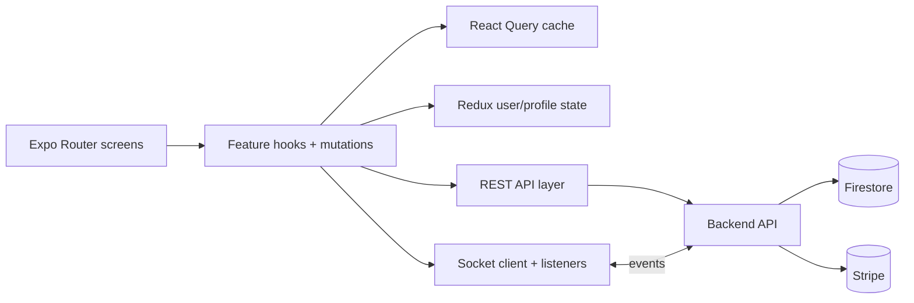
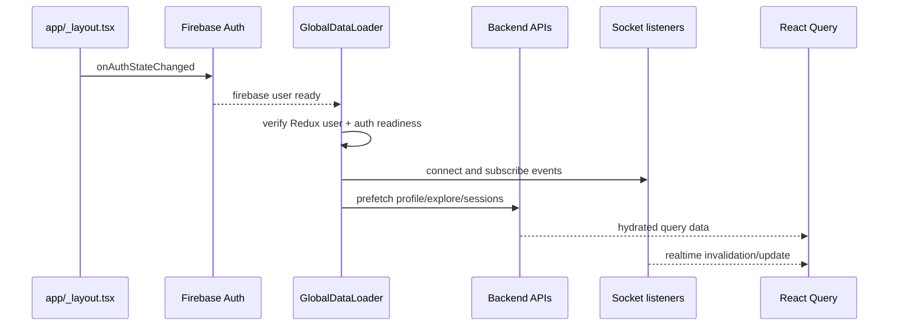
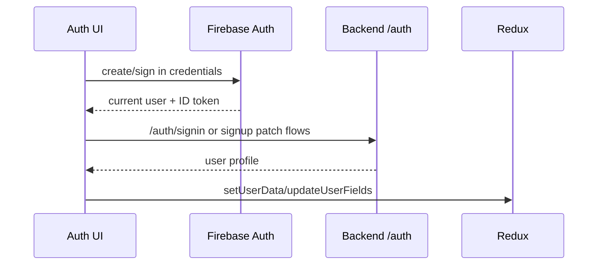
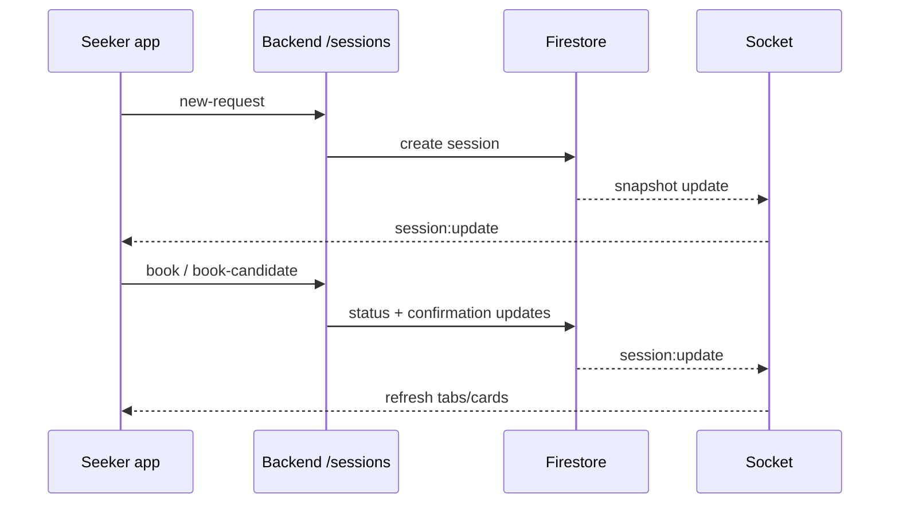

# Seeker App (`seeker-app`)

This is the care-seeker mobile client built with Expo + React Native. It consumes backend REST APIs and Socket.IO events to support onboarding, family-mode care workflows, session lifecycle management, and payment flows.

Primary runtime entrypoint: `app/_layout.tsx`.

## Tech Stack

- Expo Router + React Native
- Redux Toolkit
- TanStack React Query
- Firebase client SDK (Auth + Storage)
- Socket.IO client
- Stripe React Native SDK

## Runtime Architecture



## Boot and Provider Lifecycle

`app/_layout.tsx` composes the runtime providers in this order:

1. Redux `Provider`
2. React Query `QueryClientProvider`
3. `SessionCompletionProvider`
4. `ActiveSessionProvider`
5. `SafeAreaProvider`
6. `StripeProvider`
7. Expo Router `Stack`

`GlobalDataLoader` in the same file handles startup orchestration:

- waits for Firebase auth readiness (`onAuthStateChanged`)
- confirms Redux user exists before API work (`shouldMakeApiCalls`)
- starts global socket listeners
- prefetches user profile, explore list, and sessions
- performs foreground refresh + interval refresh



## Navigation Model (Expo Router)

Defined in `app/_layout.tsx` and nested route groups:

- `(auth)` - sign-up/sign-in/verify email
- `(onboarding)` - role/profile/family/payment onboarding steps
- `(dashboard)` - tabbed seeker experience and session entrypoints
- `(chat)` - chat screens, confirmation screens, completion screens
- `(profile)` - profile/settings/family management screens

Main stack declarations are in `app/_layout.tsx`, with per-group `_layout.tsx` files handling local route options.

## State Model

Redux store (`src/redux/store.ts`) is intentionally small:

- `user` slice
- `activeProfile` slice

React Query handles server state and invalidation-heavy session/chat data.

### Why this split

- Redux stores identity and cross-screen UI state.
- React Query stores session/message collections that frequently change from realtime events.

## API Boundaries

Core API modules:

- Auth: `src/features/auth/api/authApi.ts`
- Sessions: `src/features/sessions/api/sessionApi.ts`
- Family: `src/features/family/api/familyApi.ts`
- Profile: `src/features/currentUser/api/profileApi.ts`
- Directory: `src/features/userDirectory/api/userDirectoryApi.ts`
- Pricing: `src/features/pricing/api/usePricingQuote.ts`
- Stripe onboarding/payments:
  - `src/services/stripe/onboarding-service.ts`
  - `src/services/stripe/payment-service.ts`

All authenticated REST calls use Firebase ID tokens via `src/lib/auth.ts`.

### High-value session API methods

| Method | File | Purpose |
| --- | --- | --- |
| `getUserSessionTab` | `src/features/sessions/api/sessionApi.ts` | fetch enriched session tabs |
| `requestSession` | `src/features/sessions/api/sessionApi.ts` | create new seeker request |
| `bookSession` / `bookCandidateSession` | `src/features/sessions/api/sessionApi.ts` | booking confirmation paths |
| `sendMessage` / `getMessages` / `markMessagesRead` | `src/features/sessions/api/sessionApi.ts` | session-chat operations |
| `updateChecklist` / `addComment` | `src/features/sessions/api/sessionApi.ts` | live session collaboration updates |
| `proposeTimeChange` / `acceptTimeChange` / `rejectTimeChange` | `src/features/sessions/api/sessionApi.ts` | schedule negotiation paths |

## Realtime Layer

- Socket setup: `src/features/socket/api/socketApi.ts`
- Event subscriptions: `src/lib/socket/useSocketListeners.ts`

Primary event handling behavior:

- `session:update` -> invalidate session lists
- `chat:newMessage` -> update message cache + invalidate sessions
- `session:completed` -> optimistic cache update + navigate to completion route
- `checklist:updated` / `comment:added` -> immediate cache patch + invalidation fallback

The socket layer tracks active rooms and rejoins them after reconnect.

### Socket event map (client side)

| Event | Handler location | Typical effect |
| --- | --- | --- |
| `session:update` | `src/lib/socket/useSocketListeners.ts` | invalidate session lists |
| `chat:newMessage` | `src/lib/socket/useSocketListeners.ts` | merge message list and refresh session metadata |
| `chat:readReceipt` | `src/lib/socket/useSocketListeners.ts` | trigger list refresh for read state |
| `session:started` | `src/lib/socket/useSocketListeners.ts` | refresh live session state |
| `session:completed` | `src/lib/socket/useSocketListeners.ts` | optimistic completion + navigate to completion screen |
| `checklist:updated` | `src/lib/socket/useSocketListeners.ts` | patch checklist in cache |
| `comment:added` | `src/lib/socket/useSocketListeners.ts` | patch comments in cache |

## Seeker Flow Details

## 1) Auth + onboarding

- Sign-up and sign-in screens live under `app/(auth)`.
- Sign-in path uses Firebase auth + backend profile fetch.
- Onboarding writes critical and optional profile details through auth API routes.



## 2) Family mode

Family mode branches on `lookingForSelf` during onboarding and request creation.

- Family onboarding steps create/update family-member records via family API.
- Session request payload can target:
  - seeker self (`careRecipientType: self`), or
  - specific family member (`careRecipientType: family`, `careRecipientId`).

## 3) Session lifecycle

Session API methods cover:

- request/create
- apply/accept/reject
- book/book-candidate
- cancel/decline/start/complete/fail
- messages + read receipts
- checklist + comments
- reporting/rating/time-change proposals



Key data objects passed in this flow:

- outbound: `SessionDTO`
- inbound list/detail: `EnrichedSession[]`
- live collaboration: `ChecklistItem[]`, session comment payloads, and message payloads

## 4) Chat and live session

- Chat room join/leave is explicit (`chat:joinSession`, `chat:leaveSession`).
- Message stream is server-originated from Firestore listener snapshots.
- Live lifecycle events (`session:userConfirm`, `session:userEndConfirm`) are handled by backend live-session service and reflected back as socket events.

## 5) Payments

- App root is wrapped with `StripeProvider`.
- Payment and payout onboarding flows call backend payment/stripe endpoints.
- Session booking ties into Stripe intent verification through backend services.

## Source-Level Critical Paths

| Area | Source file | Main function/hook |
| --- | --- | --- |
| App startup orchestration | `app/_layout.tsx` | `GlobalDataLoader`, `refreshAll` |
| Session tab composition | `src/features/sessions/hooks/useSessionsTab.ts` | `useSessionsTab` |
| Live session selection | `src/features/sessions/hooks/useLiveSession.ts` | `useLiveSession` |
| Live session state machine | `src/features/sessions/hooks/useLiveSessionState.ts` | `useLiveSessionState` |
| Live socket bridge | `src/features/sessions/hooks/useLiveSessionSocket.ts` | `useLiveSessionSocket` |
| Chat screen integration | `app/(chat)/chatPage.tsx` | message query + send mutation wiring |

## Environment Variables

Common runtime env vars used in this app:

| Variable | Purpose |
| --- | --- |
| `EXPO_PUBLIC_BACKEND_BASE_URL` | backend API and socket base URL |
| `EXPO_PUBLIC_STRIPE_PUBLISHABLE_KEY` | Stripe SDK initialization |
| `EXPO_PUBLIC_FIREBASE_API_KEY` | Firebase config |
| `EXPO_PUBLIC_FIREBASE_AUTH_DOMAIN` | Firebase config |
| `EXPO_PUBLIC_FIREBASE_PROJECT_ID` | Firebase config |
| `EXPO_PUBLIC_FIREBASE_STORAGE_BUCKET` | Firebase config |
| `EXPO_PUBLIC_FIREBASE_MESSAGING_SENDER_ID` | Firebase config |
| `EXPO_PUBLIC_FIREBASE_APP_ID` | Firebase config |
| `EXPO_PUBLIC_FIREBASE_MEASUREMENT_ID` | Firebase config |
| `EXPO_PUBLIC_GOOGLE_PLACES_API_KEY` | Google places/address features |
| `EXPO_PUBLIC_PERSONA_TEMPLATE_ID` | Persona verification webview |
| `EXPO_PUBLIC_PERSONA_ENV` | Persona environment switch |
| `EXPO_PUBLIC_SKIP_ONBOARDING` | optional debug shortcut |

## Local Development

```bash
nvm use
npm install
npx expo start
```

Useful scripts:

- `npm run ios`
- `npm run android`
- `npm run web`
- `npm run test`
- `npm run lint`

## Source-Code Orientation Map

- App boot: `app/_layout.tsx`
- Session APIs: `src/features/sessions/api/sessionApi.ts`
- Session query hooks: `src/features/sessions/api/queries.ts`
- Socket client: `src/features/socket/api/socketApi.ts`
- Socket listeners: `src/lib/socket/useSocketListeners.ts`
- User store: `src/redux/userSlice.ts`
- Family APIs: `src/features/family/api/familyApi.ts`
